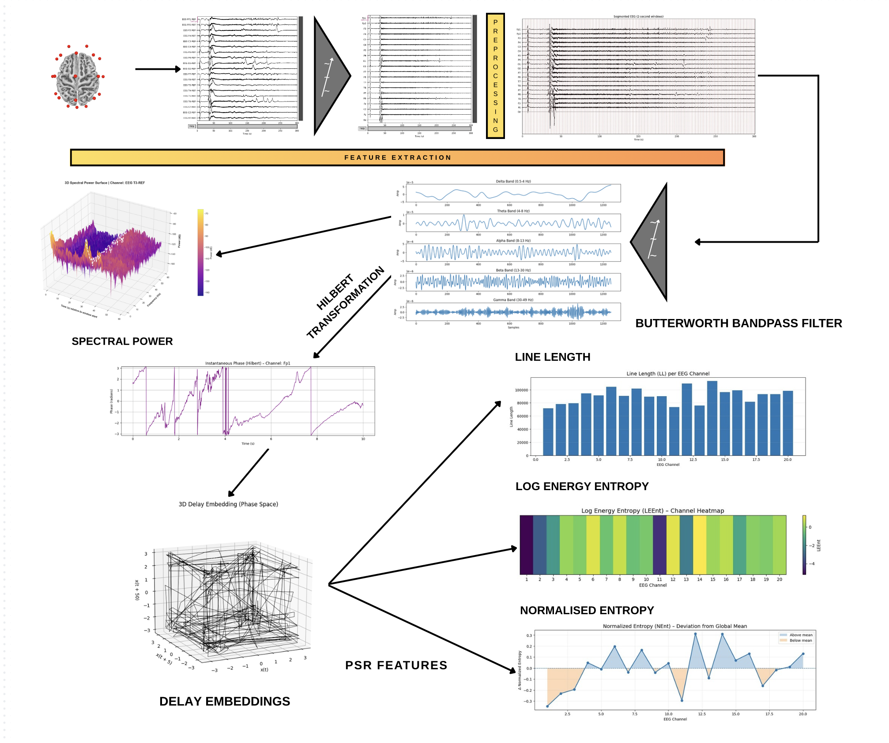

# T2P-EEG: Time-to-Phase Conversion of Oscillatory EEG Signals for Seizure Detection and Prediction

## Abstract

While electroencephalography (EEG) is the most established diagnostic modality for epilepsy, seizure detection and prediction based on EEG remain challenging tasks owing to the intrinsic noise, nonstationarity and complex, nonlinear and topographically distributed dynamics of neural activity. This work introduces a novel solution by applying a phase-space reconstruction (PSR) to the EEG signal, making it invariant to amplitude modulation, yet susceptible to the subtle change in the temporal and spatial coherence of the activity of  distributed neural assemblies preceding seizures. Extensive validation on the Temple University Hospital (TUH) EEG Seizure Corpus (TUSZ) demonstrates that the proposed framework decisively surpasses prevailing state-of-the-art approaches, attaining a receiver operating characteristic area under the curve (ROC–AUC) of 0.9715 for seizure detection and 0.9248 for seizure prediction under a 53-second forecasting horizon. All code and accompanying resources are publicly accessible {here.} 

## Dataset

This project uses the publicly available Temple University Seizure Corpus (TUS), a subset of the Temple University EEG Corpus (TUSZ). 

## Methodology

### Data Preprocessing

* Filtering, Resampling and Normalization 

* Extracting seizure annotation

* Sliding Window Segmentation

* Label generation for seizure detection and prediction

* Dataset construction

### Feature Extraction

* Decomposing of signal into different frequency bands: delta (0.5–4 Hz), theta (4–8 Hz), alpha (8–13 Hz), beta (13–30 Hz), and gamma (30–49 Hz).

* Transformation of EEG from time to phase using Hilbert transform for each band

* Constructing the Phase Space Representation (PSR) using delay embedding

* Extracting features such as Spectral Power from Hilbert transformed signal, and Line Length, Log Energy Entropy, Normalized Entropy from PSR.

## Results

XGBoost achieved an ROC-AUC of 0.9816 for seizure detection and 0.9855 for seizure prediction for a 10-minute prediction window.

## File Description

* Processing.ipynb: code for pre-processing and dataset creation. Also includes visualizations of raw EEG signal, Hilbert transformed signal, decomposed frequency bands of EEG and Spectral power.

* Seizure_detection.ipynb: code for XGBoost models with different hyperparameters trained to detect seizures

* Seizure_prediction.ipynb: code for XGBoost models with different hyperparameters trained to predict seizures
